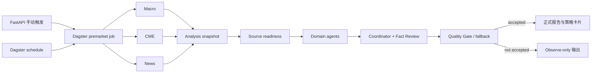

# 项目总览

> 代码基线：2026-07-21。本文以当前仓库代码和测试为准，不把历史计划或本地 artifact 自动视为线上事实。

`finance-agent` 是一个本地可运行、可追溯、可复盘的黄金研究系统，覆盖 XAUUSD、GC/CME 期权、宏观流动性、新闻事件、市场赔率、报告与策略卡片。它不是自动交易系统，不负责自动下单。


本文描述的是代码能力边界。某个数据源是否可用、某次分析是否完成，仍要以当前 source status、Dagster run 和实际 artifact 为准。


## 当前主链

- 手动入口：`POST /api/tasks/premarket`，由 API 经 Dagster GraphQL 启动 `premarket_job`。
- 定时入口：Dagster `premarket_daily`，工作日北京时间 08:30；源就绪检查被阻塞时跳过。
- FastAPI 内旧的盘前定时回调已保留为 no-op；API 内 Jin10 缓存刷新默认关闭，只有 `FINANCE_AGENT_ENABLE_API_BACKGROUND_REFRESH=1` 时启用。
- `apps/scheduler/runner.py` 和 `apps/worker/runner.py` 仍保留兼容实现，但不是当前盘前调度权威入口。

## 输出约束

- `publish_allowed=true` 只在 Quality Gate 接受某个输出时成立。
- 未被接受的结果使用 `observe` 模式和 observation artifact，不得冒充正式报告或策略卡片。
- 重要分析应绑定 `run_id`、`snapshot_id`、`input_snapshot_ids`、`source_refs` 与 `artifact_refs`。

## 当前产品界面

正式前端位于 `apps/frontend-web/src`，由 Vite、React 18、TypeScript 和 React Router 构建。主要入口包括：

- 总览、黄金主线、利率与美元、石油与地缘
- 数据接入、事件流、飞书监控、市场监控、期权结构
- 报告中心、知识库、调度中心、加工监控、人工复核
- 每日策略、系统设置、LLM 审计

`apps/frontend/` 已不是主线；FastAPI 的 `/dashboard` 等路径只提供到 Vite 前端的兼容跳转。

## 代码分层

| 层 | 当前职责 |
| --- | --- |
| `apps/api` | HTTP contract、受控触发、read model |
| `dagster_finance` | job、schedule、source readiness、run 生命周期 |
| `apps/collectors` | 官方和市场数据采集、raw 归档 |
| `apps/parsers` | PDF、JSON、HTML 等结构化解析 |
| `apps/features` | 可重复计算的特征与输入快照 |
| `apps/analysis` | domain agents、事实复核、质量门、策略与评估 |
| `apps/renderer` / `apps/output` | Markdown、HTML、JSON 和 artifact 登记 |
| `database` | 运行、分析、报告、审计和来源状态模型 |
| `storage` | `raw -> parsed -> features -> outputs` 文件链 |

## 事实边界

- 代码存在不代表外部数据源当前可用；实时状态以 `/api/data-sources/status` 和真实 run 为准。
- 测试覆盖不代表生产部署已运行；定时任务是否成功要看 Dagster run、TaskRun/TaskStep 与 artifact。
- 本仓库当前有未提交的业务代码；本文描述的是审计时工作区事实，不等同于已发布版本标签。

## 建议阅读顺序

1. [总体架构](01_ARCHITECTURE.md)
2. [后端主链](02_BACKEND_PIPELINE.md)
3. [Agent 架构](05_AGENT_ARCHITECTURE.md)
4. [Run、Snapshot 与 SourceTrace](07_SOURCE_TRACE_AND_RUN.md)
