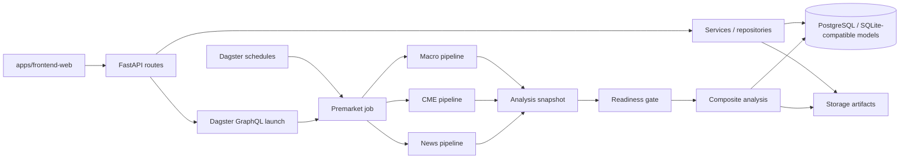

# 总体架构

> 代码基线：2026-07-21。

## 架构原则

- Core / control plane 只有一套：API 负责受控触发，Dagster 负责编排，既有 pipeline 实现负责领域执行。
- 前端只消费 API，不重复计算策略、期权墙或宏观特征。
- `raw -> parsed -> features -> outputs` 是稳定 lineage；Agent 只消费快照或上游产物。
- 缺失、过期、降级、mock 和人工补录必须显式标记。
- LLM 输出不能覆盖确定性事实；事实、外部意见和系统推断必须可区分。

## 运行拓扑

`premarket_job` 为当前盘前主链：三个领域子图可并行执行，之后合并快照，通过 fail-closed 的 source readiness gate，再进入 canonical composite analysis。


`apps/scheduler/runner.py` 和 `apps/worker/runner.py` 是兼容路径，不是新的调度权威。新增生产能力应进入 Dagster Definitions。


## 控制面与兼容面

- `apps/api/routes/`：模块化 HTTP 路由。
- `apps/api/services/`：read model、触发与状态汇总。
- `dagster_finance/definitions.py`：注册 jobs、schedules 和资源。
- `apps/worker/pipelines/`：被 Dagster ops 包装复用的领域 pipeline。
- `apps/scheduler/runner.py`、`apps/worker/runner.py`：仍存在的 legacy/compat 路径，不应与 Dagster 同时成为调度主脑。

## 数据与持久化

数据库按多个 SQLAlchemy Base 组织：

- 运行：`task_runs`、`task_steps`
- 执行可观测性：`execution_events`、`run_artifacts`
- 分析：`analysis_snapshots`、`agent_outputs`、`final_analysis_results`
- 数据状态与治理：`data_source_status`、`daily_source_health_*`、`prompt_versions`、`review_items`、`llm_call_audits`
- 报告：`report_items`、`report_artifacts`
- 领域：CME、市场 K 线、Jin10、Playbook 等表

启动时调用 Alembic runtime migration。当前已有基线 migration：`20260704_0001_unify_runtime_schema.py`；部分 `ensure_*_tables()` / additive DDL 仍保留用于兼容旧数据库。

## 前端架构

- `main.tsx` 是唯一正式路由入口。
- `AppShell` 和 `AppSidebar` 提供研究工作台框架。
- adapters 将 API contract 转换成页面 view model。
- `src/mocks` 和 fallback 仍存在；所有非 live 数据都必须在 UI 中显式标注。

## 安全边界

- 设置和密钥写 API 必须使用结构化参数，不把 secret 返回给前端。
- 手工上传是兜底，不是默认采集主流程。
- 本地文件路径只能作为内部 artifact reference，公开文档和外部输出不得泄露工作站绝对路径或凭据。

## 相关内容

- [后端主链](02_BACKEND_PIPELINE.md)
- [数据模型与存储](04_DATA_MODEL_AND_STORAGE.md)
- [Run、Snapshot 与 SourceTrace](07_SOURCE_TRACE_AND_RUN.md)
