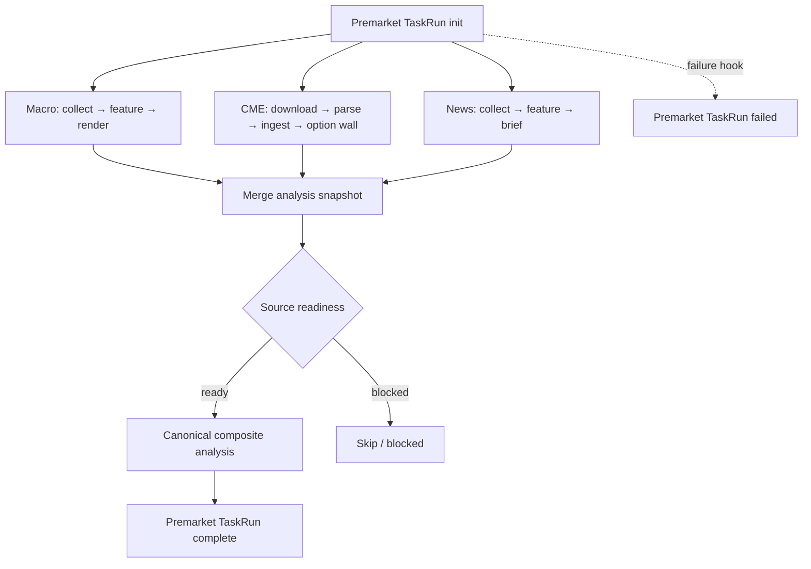

# 后端主链

> 代码基线：2026-07-21。

## 触发与调度

| 入口 | 当前行为 |
| --- | --- |
| `POST /api/tasks/premarket` | preflight 后通过 Dagster GraphQL 启动 `premarket_job` |
| `GET /api/tasks/premarket/preflight` | 只读返回 legacy active task、Dagster active run、源就绪状态和阻塞原因 |
| `premarket_daily` | 工作日 08:30（Asia/Shanghai）触发；readiness blocked 时 Skip |

`force=true` 只影响受支持的 preflight 条件，不能绕过所有安全边界。API 会检查仍活跃的 legacy TaskRun、Dagster run 和数据源 readiness。

## Dagster 盘前图



失败 hook 负责把失败状态回写 TaskRun。当前工作区中的 `task_run_lifecycle.py` 仍是未提交文件，因此该能力应在合并前继续接受测试和 review。

## Canonical composite analysis

`apps/worker/composite_analysis_pipeline.py` 是当前综合分析权威实现：

1. 运行 macro、CME options、risk、technical、positioning、news、market odds 等 domain agents。
2. Coordinator 汇总领域输出。
3. Fact Review 检查 claims 和证据。
4. Synthesis / Quality Gate 形成候选决策。
5. 必要时执行 fallback，再次过门。
6. 只有被接受的 candidate 能生成 accepted final report / strategy card；其他结果写为 observe-only。


正式消费者只读取 Quality Gate 接受的 candidate。生成了文件但 `publish_allowed=false`，仍然不是正式分析结论。


## 数据层职责

- Collectors：获取外部数据并保存 raw payload 或原始文件。
- Parsers：把 raw 转成结构化记录，保留 warning，不补造缺失字段。
- Features：计算可重复指标、事件候选、市场绑定和领域快照。
- Analysis：消费快照，不直接改写 raw/parsed。
- Renderer：把结构化结果渲染为 Markdown/HTML/JSON，不承担数据采集。
- Output：写入稳定路径并登记 artifact / report metadata。

## 兼容与边界

- `apps/worker/runner.py` 可继续服务兼容测试或手工路径，但新调度能力应挂到 Dagster。
- API 后台刷新默认关闭；启用时仅运行 Jin10 cache refresh，盘前 schedule 仍归 Dagster。
- 任务“启动成功”不等于分析“发布成功”；最终必须同时检查 run status、readiness、quality gate 和 artifact。

## 最小验收

```bash
UV_CACHE_DIR=/tmp/uv-cache rtk uv run pytest \
  tests/api/test_premarket_trigger_api.py \
  tests/worker/test_dagster_task_run_lifecycle.py \
  tests/worker/test_dagster_agent_ops.py -q
```

真实验收还需检查 Dagster run、`task_runs` / `task_steps`、analysis snapshot 和 accepted/observe artifact 是否一致。

## 相关内容

- [Agent 架构](05_AGENT_ARCHITECTURE.md)
- [报告系统](06_REPORT_SYSTEM.md)
