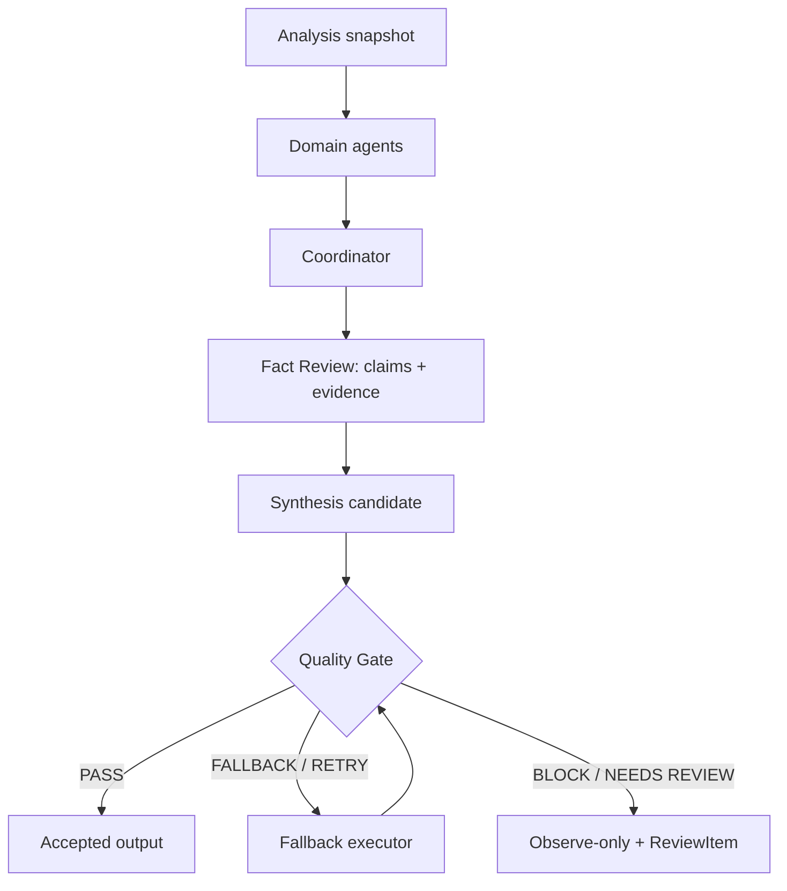

# Agent 架构

> 代码基线：2026-07-21。

## 角色与边界

Agent 是 analysis 层的受约束分析器，不是第二套任务调度器。它们读取 analysis snapshot、feature 或已有 output，不得修改 raw/parsed 数据。

当前 canonical composite analysis 位于 `apps/worker/composite_analysis_pipeline.py`，并由 Dagster `canonical_composite_analysis_op` 调用。

## 领域 Agent

当前综合链包含：

- `macro_liquidity`
- `cme_options`
- `risk`
- `technical`
- `positioning`
- `news`
- `market_odds`

仓库还包含 `market_regime`、`event_impact`、Gold runtime agents、weekly context revision、macro event follow-up 等专项实现；它们是否进入某个定时 job 以实际 graph/调用链为准。

## 协调、核查与质量门

- Coordinator 负责聚合，不重写来源事实。
- Fact Review 逐 claim 检查来源、冲突和不可用状态，并可同步 ReviewItem。
- Quality Gate 的 `accepted_output` 是发布权威；`publish_allowed` 必须与其一致。
- fallback 只有再次 `PASS` 才能成为 accepted output。


Agent 输出是带来源的分析产物，不是原始事实。任何方向性结论都必须经过 Fact Review 与 Quality Gate。


## 输出契约

`AgentOutput` 保留 agent identity、bias、confidence、findings、risks、watchlist、invalid conditions、claims、`input_snapshot_ids` 和 `source_refs`。使用 LLM 时还应关联 prompt/version/model/audit metadata。

质量门失败时：

- 输出模式为 `observe`。
- artifact 类型使用 observation report/card。
- 不生成可被正式策略消费者误读的方向性 accepted 输出。

## 治理接口

系统提供 Agent registry、Prompt 版本、激活、feedback、proposal 和 system evolution API。Prompt 与反馈属于治理数据；修改它们不能改变上游事实，也不能绕过 Fact Review / Quality Gate。

## 持久化

- `analysis_snapshots`
- `agent_outputs`
- `final_analysis_results`
- `review_items`
- `prompt_versions` / `prompt_feedback`
- `llm_call_audits`

检查 Agent 是否“已运行”时，应以对应 run、persisted output、audit 和 artifact 为证据，不能只看模块存在。

## 相关内容

- [后端主链](02_BACKEND_PIPELINE.md)
- [报告系统](06_REPORT_SYSTEM.md)
- [Trace Schema](TRACE_SCHEMA.md)
