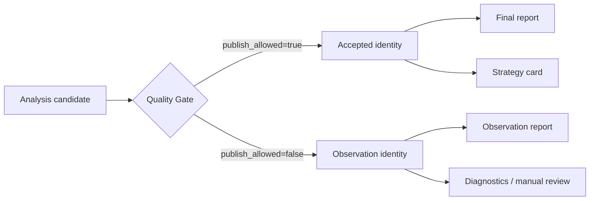

# 报告系统

> 代码基线：2026-07-21。

## 标准模型

- `report_items` 保存报告身份、family、日期、run/snapshot、状态和来源。
- `report_artifacts` 保存 artifact type、路径、hash、content type、版本和来源。
- `/api/reports/*` 提供索引、详情、artifact、source、analysis、visual、evidence 和 analysis-inputs read model。

公共 `ArtifactType` 包括：`source_md`、`analysis_md`、`visual_html`、`structured_json`、`raw_file`、`parsed_file`、`feature_json`、`chart_snapshot`。

## 报告族

| 报告族 | 当前接口 |
| --- | --- |
| 综合报告 | `/api/final-report/latest`、`/api/final-report`、标准 report API |
| 策略卡片 | `/api/strategy-card*`、`/api/strategy-cards*` |
| CME Options | `/api/options/report`、`/api/options/visual-report*` |
| Macro | `/api/macro/report` |
| Jin10 daily/weekly/bundle | `/api/jin10/*report*` |
| Market Odds | `/api/market-odds/report` |
| 新闻日报/触发/follow-up | `/api/news/daily-*` |

legacy 专用接口与标准 report API 仍并存。新增消费者应优先使用标准 report identity 和 artifact registry；兼容接口需明确标注来源与状态。

## Accepted 与 observe-only

Canonical composite analysis 根据 Quality Gate 决定输出模式：

- `accepted`：允许写正式 `final_report` 和 `strategy_card`。
- `observe`：只写 `observation_report` / `observation_strategy_card`，供诊断和复核，不进入正式消费面。


下游不能按“最新文件”决定正式输出，必须跟随 accepted identity 和 `publish_allowed`。


“文件生成成功”不等于“允许发布”。前端和下游服务必须消费 `publish_allowed` / accepted identity，而不是仅按最新文件名选择。

## Artifact 完整性

一个报告族不必强制生成所有展示格式，但实际声明的 artifact 必须：

- 文件存在且非空；
- `artifact_type` 与内容一致；
- 绑定 report、run、snapshot 和 source refs；
- 记录 hash、生成时间和 content type（可取得时）；
- 缺失时返回 unavailable/partial，不伪造占位文件。

## 前端职责

`ReportsPage` 只做索引和筛选；`ReportDetailPage` 展示 source、analysis、visual、evidence、analysis inputs、Agent outputs、Fact Review 和 LLM audit。页面不重新拼装报告结论。

## 当前风险

- 历史报告可能没有完整 `ReportItem` / `ReportArtifact`。
- legacy 与标准入口可能对同一报告返回不同形态。
- 各 family 的 artifact 覆盖度仍需逐族 regression；不能把 API 存在写成所有文件均已生成。

## 相关内容

- [Agent 架构](05_AGENT_ARCHITECTURE.md)
- [Run、Snapshot 与 SourceTrace](07_SOURCE_TRACE_AND_RUN.md)
- [API 映射](10_API_MAP.md)
