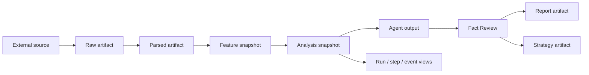

# Run、Snapshot 与 SourceTrace

> 代码基线：2026-07-21。

## 追溯目标


历史 artifact 缺少完整引用时，系统应返回 partial 或 unavailable；不能根据文件名猜测并补造 lineage。


## Run

`TaskRun` 是 canonical run，`TaskStep` 是 canonical step。Dagster premarket job 在开始、成功和失败路径同步生命周期；旧 TaskRun 可被 preflight 标记为 `stale`。

只读接口：

- `/api/runs`
- `/api/runs/{run_id}`
- `/api/runs/{run_id}/steps`
- `/api/runs/{run_id}/logs`
- `/api/runs/{run_id}/artifacts`
- `/api/runs/{run_id}/events`
- `/api/artifacts/{artifact_id}`

## Snapshot

`AnalysisSnapshot` 记录 `snapshot_id`、asset、trade date、run、payload、`input_snapshot_ids`、`source_refs`、status 和 artifact path。Premarket merge 会把 macro、CME、news 与 Gold daily context 合并为同一输入快照。

## SourceTrace

接口：

- `/api/source-trace/{snapshot_id}`
- `/api/source-trace/by-report/{report_id}`
- `/api/source-trace/by-strategy/{strategy_card_id}`
- `/api/source-trace/by-artifact/{artifact_id}`

公共 contract 使用 `SourceRef`、`ArtifactRef`、`SnapshotRef` 和 `SourceTraceResponse`。前端 Report、Strategy、Run detail 和 Processing Monitor 都应沿这些 id 下钻。

## Processing trace

加工监控还提供按 `trace_id`、`event_id`、`input_id`、`source_ref`、`mainline`、`chain_id` 的只读检索，用于补充 run-centric lineage；它不能替代 source refs 与 artifact registry。

## 验收问题

任意正式结论都应能回答：

1. 来自哪个 `run_id` 和 `snapshot_id`？
2. 使用了哪些 input snapshots 与外部来源？
3. 中间和最终 artifact 在哪里、hash 是什么？
4. 是否包含 stale、partial、fallback、mock 或 manual-required 输入？
5. Quality Gate 接受了哪个 candidate？若未接受，为什么仍可见？

历史 artifact 缺少这些字段时，应显式返回不可追溯或部分可追溯，不能补造 lineage。

## 相关内容

- [数据模型与存储](04_DATA_MODEL_AND_STORAGE.md)
- [Trace Schema](TRACE_SCHEMA.md)
- [报告系统](06_REPORT_SYSTEM.md)
